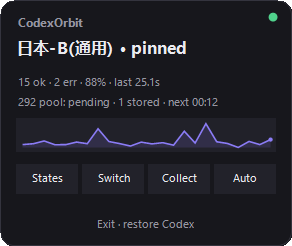
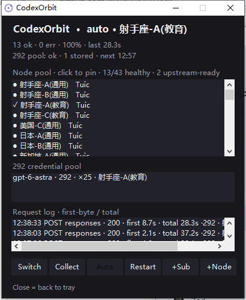
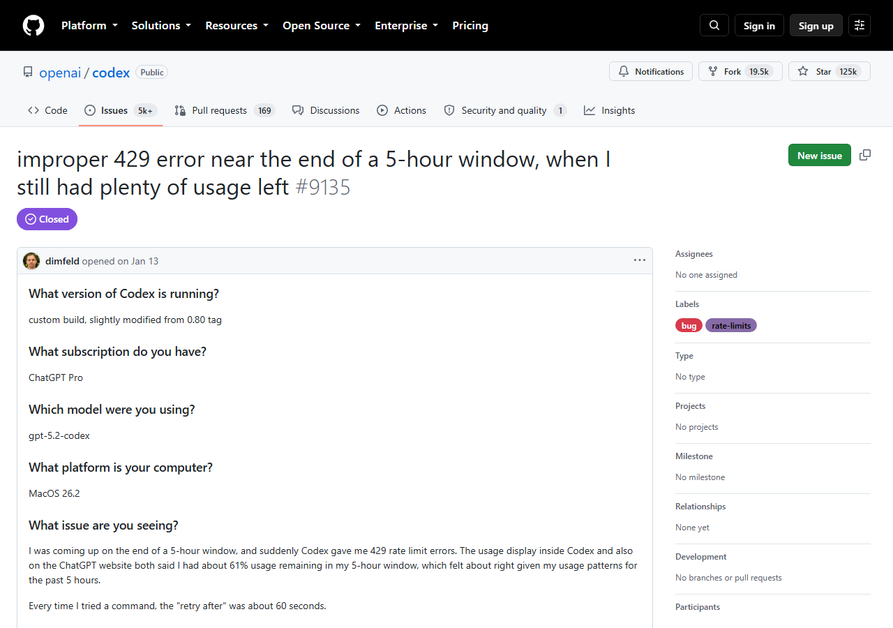
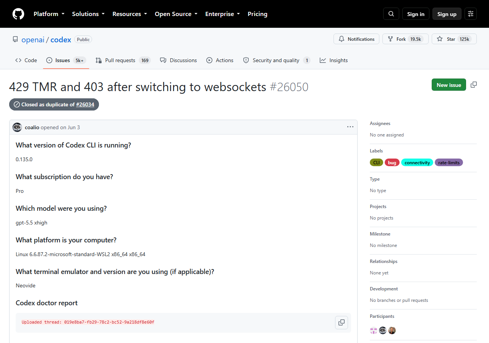
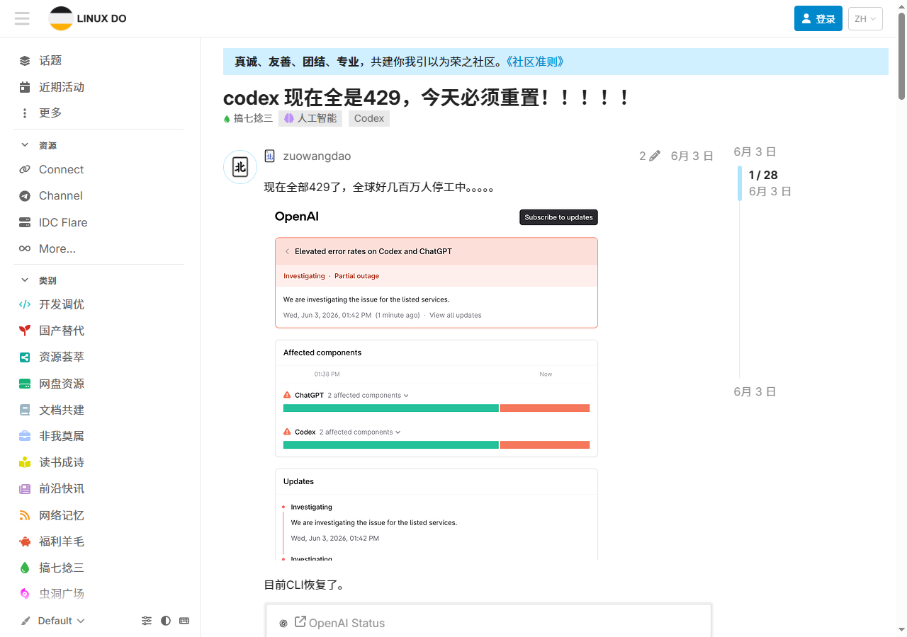

<p align="center">
  
</p>

# CodexOrbit

**[中文](README.md) · English**

[](../../stargazers)
[](../../releases)
[](../../releases)
[](../../issues)
[](LICENSE)


## Contents

- [What it does](#what-it-does)
- [Feature overview](#feature-overview)
- [How it works](#how-it-works)
- [Console and menu](#console-and-menu)
- [Files and data](#files-and-data)
- [FAQ](#faq)
- [Changelog](#changelog)
- [Security and privacy](#security-and-privacy)
- [Why the disconnects fade](#why-the-disconnects-fade)
- [Every error you've seen, translated](#every-error-youve-seen-translated)
- [It's not just you](#its-not-just-you)
- [Install](#install)
- [Too lazy? Let your AI install it](#too-lazy-let-your-ai-install-it)
- [Build it yourself](#build-it-yourself)
- [How it talks to ccodex-rotate](#how-it-talks-to-ccodex-rotate)
- [For contributors](#for-contributors)
- [Honest limits](#honest-limits)
- [Community](#community)


> **You pay OpenAI $200 a month. What you get: reconnect ×5, 429 purgatory, "overloaded" lobotomy, 502 Bad Gateway, streams severed mid-sentence, "stream closed before response.completed".**
>
> Paid in full, goods never delivered. It's not your account; the road upstream is rotten.

<p align="center">
  
</p>

**CodexOrbit** is a Windows tray companion for [ccodex-rotate](https://github.com/446599/CCODEX-ROTATE): it finds healthy exits and pins them, kicks dead nodes into cooldown, auto-collects and injects `X-Codex-Turn-State`. **So your Pro subscription actually feels like Pro.**

<p align="center">
  
</p>

## What it does

Zero console windows, zero browser tabs. Runs silent in the tray. **It ships its own native console window**, so the web panel is never needed.

<p align="center">
  
</p>

- **Left-click → status card**: node, success rate, last latency, 292 countdown + a **sparkline of your last 24 requests**
- **Double-click → console**: full node list (✓ pinned · type · live delay, click to pin), collected 292 credentials, add subscriptions/nodes, restart, one native window for everything
- **Right-click → action menu**: pin node (✓ current lock + live delay) / credentials 292 (collected states: model · hits · source node) / **add source** (paste subscription or share links) / switch node / collect 292 / auto select (greyed when auto) / restart service / **language switch** (中文/English, remembered)
- **Balloon alerts**: service dies → auto-relaunch, node switches. You get notified, no babysitting
- **It remembers**: `CodexOrbit.memory.json` keeps your last pinned node and last good 292 source. On relaunch an empty pool triggers a fresh collect and the pin restores itself; service up/down, node hops, pool changes and manual actions all land in `CodexOrbit.log` (open it straight from the tray menu)
- **Self-launching**: spins up `orbit-core serve` hidden on start; if the process dies it's back within 4 seconds
- **Icon tells the truth**: violet = healthy · amber = error spike · red = offline · grey = starting
- **Clean exit**: quit = stop service + kill orphan kernels + `restore` your `config.toml`. No dangling pointer to a dead proxy

## Feature overview

### Nodes and routing

| Feature | What it does |
|---|---|
| Health patrol | The engine probes every node every 45s; dead nodes cool down before a request can hit them |
| One-click pin | Pin from the tray menu or by clicking a node in the console; measured latency shown in the list |
| Auto routing | `Restore auto` unpins and hands selection back to url-test; greyed out while already auto |
| Switch node | In auto mode, force-rotates to the next healthy node; every hop is logged |
| Upstream-ready flag | The node pool separates "healthy" from "verified upstream-reachable" - connecting is not the same as sustaining a stream |

### 292 credential pool

| Feature | What it does |
|---|---|
| Auto collection | Missing state auto-collects; after a success it re-collects on a 30-minute cycle |
| Failure retry | A failed collect retries automatically after 5 minutes |
| Credential injection | Collected `X-Codex-Turn-State` is injected into requests; `inject_node_affinity` binds it to the producing node |
| Pool visibility | Console and status card show stored count, collecting flag, and next scheduled collect |
| Values never shown | Credential values never appear in the UI or logs - only model, hit count, and source node |

### Supervision and self-healing

| Feature | What it does |
|---|---|
| Service spawn | Launches `orbit-core serve` hidden on start - no black windows ever |
| 4-second self-heal | If the engine dies, the patrol kills orphan mihomo processes and relaunches |
| Crash recovery | If the tray itself exits, the logon autostart shortcut revives the whole stack |
| Failure guidance | 3 failed requests in a row (403/429/5xx) -> one-click balloon fix: switch node AND re-collect the 292; console and status card highlight the right button |
| Clean exit | Quit = stop service + kill orphan kernels + `restore` your `config.toml` |

### Memory and log

| Feature | What it does |
|---|---|
| Persistent memory | `CodexOrbit.memory.json` records the pinned node and the last good 292's model and source node |
| Restart continuity | Empty pool + remembered credential triggers auto-collect; a remembered pin restores itself |
| Pool watchdog | Empty 292 pool while the engine is idle -> the tray nudges a collect every 150s; the Collect button is just an accelerator |
| Local log | `CodexOrbit.log` records startup, spawns, outages, node hops, pool changes, manual actions; open it from the tray menu |
| Request log | Console streams every request: status, **TTFT / total time**, serving node, retries, 292-injection flag |

## How it works

```text
+----------+   HTTP    +-------------+   local API :17850   +-------------+
| tray app | --------> | orbit-core  | <-----------------> | CodexOrbit  |
| (card/   |  poll 4s  | (router     |                     |  console    |
|  menu)   | <-------- |  engine)    |                     |             |
+----------+           +------+------+                     +-------------+
                              | embeds
                       +------+------+    node pool (vless/ss/trojan/hysteria2/tuic)
                       |   mihomo    | --------------> upstream https://chatgpt.com
                       |  mixed:17890|
                       |  ctrl :17891|
                       +-------------+
```

- The tray only speaks **loopback HTTP** - it never touches node config directly; every node action goes through an `/api/*` endpoint.
- The 292 pool is a **credential metric** (stored count, collect schedule); the node pool is a **routing metric** (healthy count, upstream-reachable count). They mean different things and are shown separately.
- `Auto` only restores url-test routing; collection runs on its own scheduler - 30 minutes after success, 5 minutes after failure.

## Console and menu

The console's six buttons:

| Button | Behavior |
|---|---|
| Switch | In auto mode, force-rotate to the next healthy node |
| Collect | Trigger one 292 collect now (runs in background, doesn't wait for the schedule) |
| Auto | Unpin and restore url-test; greyed out while already auto |
| Restart | Restart the orbit-core service (orphan mihomo is cleaned first) |
| +Sub / +Node | Paste a subscription link or a `vless:// ss:// trojan:// hysteria2:// tuic://` share link |

The console shows three live lists: node pool (click to pin), 292 credential pool (model · length · hits · source), and the request log (time · method · path · status · TTFT/total · retries · injection · node), refreshing every 4 seconds.

Beyond the buttons, the tray menu offers: pin node (with measured latency), 292 credential pool detail (model · hits · source node), add source, clear all sources, language switch, open log, and exit-and-restore (with a confirmation prompt).

## Files and data

| Path | Contents |
|---|---|
| next to `CodexOrbit.exe` | `orbit-core.exe` (the upstream engine, bundled in the zip) |
| `~/.ccodex-rotate/config.json` | Subscription, node, and collect-schedule config (untouched by this tool) |
| `~/.ccodex-rotate/mihomo/` | mihomo runtime directory |
| `CodexOrbit.memory.json` | Persistent memory: pinned node, last good 292 model and source node |
| `CodexOrbit.log` | Local event log, auto-truncated past 1MB |

## FAQ

**Does "Auto" trigger a collect?** No. `Auto` only calls `/api/reset` - it unpins and restores url-test routing. Collection is its own scheduler: collect on missing state, renew 30 minutes after success, retry 5 minutes after failure, expire after 1 hour unused.

**What happens on a crash?** Three layers: orbit-core dies -> orphan mihomo is cleaned and it's relaunched within ~4s; the tray itself dies -> the service keeps running and the logon autostart shortcut revives the tray; the machine reboots -> everything starts at login.

**Does the 292 pool rotate on a schedule?** Yes. Success interval 1800s, failure retry 300s, states expire after 3600s unused; `auto_collect` also tops up whenever a request lacks state, without waiting for the schedule.

**Does it need admin?** No. No registry writes, no service install, no system-proxy changes.

**Which node protocols are supported?** Subscription links, plus `vless://` `ss://` `trojan://` `hysteria2://` `tuic://` share links.

**What happens to my Codex config on exit?** "Exit · restore Codex" stops the service, kills orphan kernels, and runs `restore` on your `config.toml` - no dangling pointer to a dead proxy.

## Changelog

### v1.1.0

- New console **request log**: per-request status, TTFT/total time, serving node, retries, 292-injection flag (TTFT needs the bundled new orbit-core)
- Release zip now bundles orbit-core - unpack and run, no more hunting for the engine
- Empty 292 pool is self-healing now: the tray re-triggers collection, no manual clicking; live collect progress (x/y)
- Console auto-refreshes every 4s (it used to fetch once on open and go stale)
- Failure streaks proactively guide you: balloon offers a one-click fix, console/status card highlight the right button
- Balloon guidance on missing/failed engine; empty pools show next-step hints; exit asks for confirmation

### v1.0.0

First public release: native console, separated 292/node pools, persistent memory, local log, crash self-heal, node pinning and auto-routing, bilingual UI.

## Security and privacy

- All traffic between the tray and the engine is `127.0.0.1` loopback; no telemetry, no external reporting.
- 292 credential values **never appear** in the UI or the log - only model, hit count, and source node.
- No registry writes, no service install, no system-proxy changes; no admin required.
- Subscription and node config stays in `~/.ccodex-rotate/config.json`, which this tool never rewrites.

## Why the disconnects fade

`stream closed before response.completed` happens when **your request lands on a rotten node or a rotten session**: once SSE starts flowing, a mid-stream death can't be replayed invisibly. So the whole design is **pre-emption**:

| Mechanism | What it does |
|---|---|
| mihomo health checks | Probes every 45s; dead nodes cool down before a request ever touches them |
| 292 auto-collect + inject | Missing state → auto-collect → auto-inject → auto-refresh, upstream treats you as a healthy session |
| `inject_node_affinity` | A 292 is bound to the node that produced it, never injected across nodes |
| `collect_on_start` | Warm-up sweep at launch, so your first request isn't the guinea pig |

You never think about "collect mode vs auto mode": **collection always runs in the background; your only job is clicking an icon.**

## Every error you've seen, translated

Not just 429. These were all captured live. The symptoms vary wildly, but the root cause is always one of two things: **a rotten node** or **a missing 292 demoting you**:

| What you see | What actually happened |
|---|---|
| `429` / `exceeded retry limit` | Shared exit got flagged; and Codex hard-codes `retry_429: false`, so **it never even retried** |
| `overloaded` / sudden lobotomy | Missing 292 turn-state, so upstream treats you as anonymous traffic |
| `502 Bad Gateway: Unknown error` | The node you landed on is dead; we measured a WS node whose entry point replies `403 Forbidden` outright |
| `failed to dial WebSocket: 403` | The node's CDN entry refused it, **not OpenAI refusing you** |
| `stream closed before response.completed` | Node died mid-stream, or the proxy's total request deadline cut it off |
| Reconnect ×5 | The dead node was never evicted, so every retry hit the same corpse |
| Spinning forever / first-token timeout | Node "connects" but can't sustain a stream; a ping test can't measure that |

**Different error text, same disease: the road.** CodexOrbit's job is to kill bad roads before your request ever reaches them.

## It's not just you

Don't take my word; take the official `openai/codex` issue tracker and the Chinese community's own complaints.

**The smoking gun is in the source**: Codex hard-codes `retry_429: false` ([openai/codex#30471](https://github.com/openai/codex/issues/30471)). `exceeded retry limit, last status: 429` is a lie; it **never retried at all**. The first 429 is served straight to you. Waiting for the client to heal itself is a dead end. The only fix is governing *which road your request takes*. That's what this tool is for.

| Paid user, 61% quota left, still 429 | "After reconnecting 5 times" (official issue, verbatim) |
|---|---|
| <a href="https://github.com/openai/codex/issues/9135"></a> | <a href="https://github.com/openai/codex/issues/26050"></a> |

| "pro*20 account… what did I pay real money for" | Global 429 meltdown; OpenAI status page lit red |
|---|---|
| <a href="https://linux.do/t/topic/2349056"></a> | <a href="https://linux.do/t/topic/2296878"></a> |

More evidence (mid-stream disconnects, throttling analysis, the `retry_429` source trace) in [docs/evidence/](docs/evidence/).

## Install

**Before you start, you'll need**:

- At least one node source: a subscription URL, or `vless:// ss:// trojan://` share links — add via tray "Add source" or the console `+Sub`/`+Node`
- If SmartScreen says "Windows protected your PC" on first run: click "More info" → "Run anyway" (normal for unsigned apps); the tray icon may hide in the "^" overflow area — drag it out

**Compatibility**: Windows 10 / 11 (probably Win8+ too), runs on the .NET Framework 4.x that ships with Windows, **zero runtime installs**; ARM64 Windows works via built-in emulation; no admin needed. The release zip is unpack-and-run (tray ~58KB + engine ~9.6MB) with its own orbit icon.

1. Grab `CodexOrbit-*-windows-x64.zip` from the [latest release](../../releases/latest) and extract it anywhere
2. Double-click `CodexOrbit.exe` (`orbit-core.exe` ships in the zip — just keep the two files together)
3. Autostart: `Win+R` → `shell:startup` → drop a `CodexOrbit.exe` shortcut in

> `orbit-core.exe` is built by us from upstream ccodex-rotate source with our own TTFT (time-to-first-byte) patch — source and patch are public at [Reality-JH/ccodex-rotate](https://github.com/Reality-JH/ccodex-rotate), so you can reproduce the build yourself.

It reads `~/.ccodex-rotate/config.json` as-is (your subscription and nodes are untouched).

## Too lazy? Let your AI install it

Paste this to your AI assistant (Codex, Windsurf, Cursor, Claude — any agent):

> Deploy CodexOrbit for me: https://github.com/Reality-JH/CodexOrbit
> Follow the README setup: download the latest release zip for Windows, extract it somewhere sensible,
> run CodexOrbit.exe, and tell me once the tray icon shows up and the console opens.

**UI language** follows your OS display language automatically. Force it with `CodexOrbit.exe --lang=en` or `--lang=zh`.

## Build it yourself

Nothing to install; Windows ships .NET Framework:

```cmd
build.cmd
```

Produces a ~58KB `CodexOrbit.exe`, zero third-party deps, single-file source at `src/CodexOrbitApp.cs`, audit away. Self-builds only make the tray side — the engine still comes from the release zip or upstream.

## How it talks to ccodex-rotate

Local HTTP API (`http://127.0.0.1:17850`):

| Action | Endpoint |
|---|---|
| Status poll (incl. latency history) | `GET /api/status` |
| Node list | `GET /api/nodes` |
| Pin node by name | `POST /api/pin` |
| Switch node | `POST /api/rotate` |
| Collect 292 | `POST /api/collect` |
| Reset to auto | `POST /api/reset` |
| Add subscription/node | `POST /api/sources/add` |
| Clear all sources | `POST /api/sources/clear` |
| Health probe | `GET /healthz` |

## For contributors

- `CodexOrbit.exe --preview`: status card centered (marketing screenshots)
- `CodexOrbit.exe --shot out.png`: headless render of the current card to PNG
- `CodexOrbit.exe --lang=en|zh`: force UI language

## Honest limits

It meaningfully improves connection quality, but it **doesn't add quota and can't promise a 100% cure**: upstream 401/403/429s still happen and still need waiting out. What it does do: stop one rotten node from ruining a session you paid for.

## Community

Questions or ideas? Join the group: **QQ 758423201**

<p align="center">
  
</p>

## License

Non-commercial use only · see [LICENSE](LICENSE)
